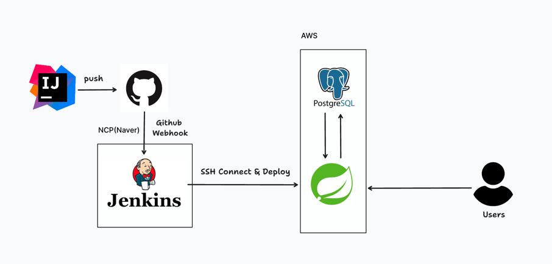

# 🔨 프로젝트 소개

## 🍦 베스트 라빈스

**선택하기 어려운 수많은 아이스크림 조합들, 우리가 추천해줄게!**

배스킨 라빈스 아이스크림을 모르거나 조합을 결정하기 힘든 사람들을 위한 재료 기반 아이스크림 추천 서비스

# 🔨 프로젝트 배포 혹은 데모

배포: [베스트라빈스](https://quarter-fe.vercel.app/)

서비스 소개: [소개 노션](https://triangular-trombone-8fb.notion.site/22d4c55a4508466e8dcf7b91caaeb910)

# 🔨 프로젝트 주요 기능

- 메인 페이지의 캐로셀 슬라이더를 통해 독특한 아이스크림 조합을 추천받을 수 있습니다.
- 원하는 사이즈와 재료들을 선택하여 아이스크림 조합을 추천받을 수 있습니다.
- 카카오 로그인 및 추천 조합을 저장할 수 있습니다 (개발 중)

# 🔨 프로젝트 구조 및 기술 스택

## 1. 프로젝트 구조



## 2. 기술 스택 및 API
Kotlin & Spring

API 명세: [API RestDocs](https://www.bestrobbins-api.o-r.kr:8080/docs/index.html)


# 🔨 프로젝트 특이사항

## 1. 추천 알고리즘
재료 기반 맛 추천 알고리즘은 아래와 같습니다.
- 각 맛(Flavor)은 1개 이상의 재료(Ingredient)로 구성
- 선택한 재료를 포함하는 모든 맛은 후보가 됨
- 후보가 선택한 사이즈(Size)보다 작다면 재료를 추가 선택해야만 함
- 충분한 후보 (size보다 많은 맛의 개수)가 존재할 경우, 조합 추천
- 모든 후보 중 랜덤하게 size 개수만큼 선택

랜덤성이 높은 알고리즘이라, 추후 기호에 맞게 추천이 될 수 있도록 추가 예정입니다.

아래는 코드 일부입니다.
```kotlin
private fun getRecommendedFlavors(ingredientIds: List<Long>, size: Size): List<Flavor> {
  val flavors = flavorService.findFlavorsByIngredientIds(ingredientIds)
  if (flavors.size < size.value) throw IllegalArgumentException("size보다 적은 개수의 맛만 존재합니다.")

  return flavors.shuffled().take(size.value)
}
```

## 2. CI / CD
Jenkins를 이용해 CI/CD 파이프라인을 구축했습니다.
[블로그](https://ggam-nyang.github.io/passion/best-robbins/jenkins/)

## 3. RestDocs
Spring RestDocs를 이용해 API 문서를 배포했습니다.
[API RestDocs](https://www.bestrobbins-api.o-r.kr:8080/docs/index.html)

## 4. 초기 기획 및 디자인 참여

기획자와 디자이너, 프론트 개발자와 협업하며 기획에 적극적으로 참여하고 서비스 아이디어를 제안했습니다.

- 참고: [알고리즘 공유](https://www.notion.so/00bdd432100643da95e371414e490124?pvs=4)

# 🔨 프로젝트 회고

## 1. 좋았던 점

- 기획자, 디자이너와의 협업을 통해 조금은 현업에서의 프로세스를 경험해볼 수 있었다고 생각합니다.
- 10일 간의 짧은 기간동안 MVP를 설정하고 목표했던 기능들을 구현했습니다.

## 2. 아쉬운 점

- 짧은 시간이라 기술적으로 많은 고민을 하지 못했습니다.
- 적용해보고 싶었던 기술들이 많았지만 기간 내 완성에 초점을 맞추어 적용하지 못한 점이 아쉬웠습니다. (Flyway, Redis 캐시 서버 등)

## 3. 앞으로의 방향

- 로그인 및 조합 저장 기능 추가
- Flyway, Redis 캐시 서버 도입